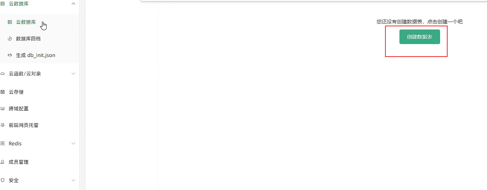
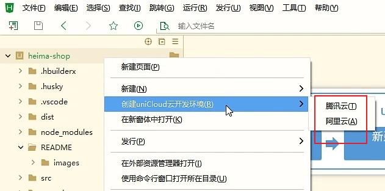
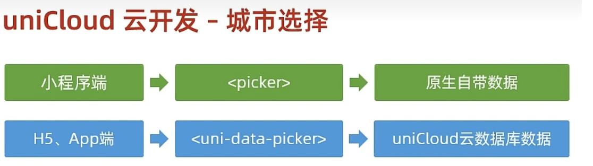
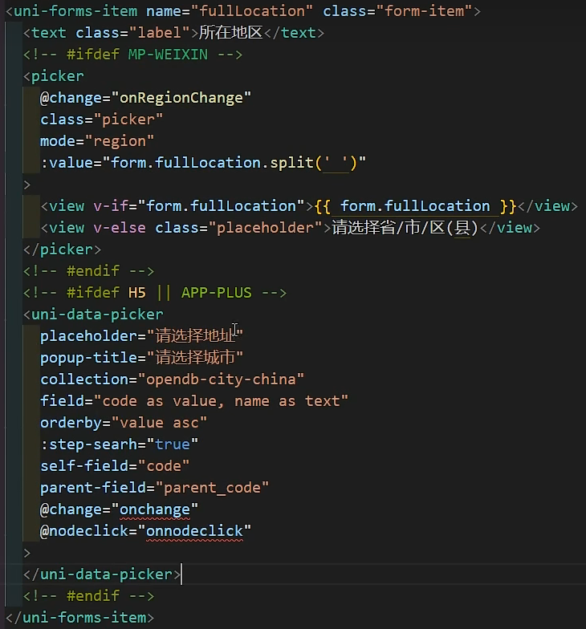

## uni-app 学习，杂记，打包等

## uni-app uniclound 协同开发流程

### 1.选择好云服务平台后，新建数据表

### 2.前端关联uniclound云开发环境

### 3.下载云端的数据库表

### 4.开发picker城市选择基本流程

``<picker>`` 只支持小程序段，自带数据。其他需要用到 ``<uni-data-picker>``

### 5.条件编译

